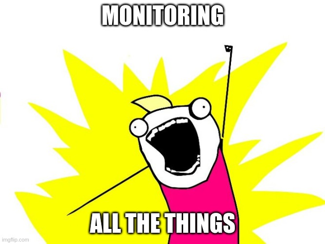
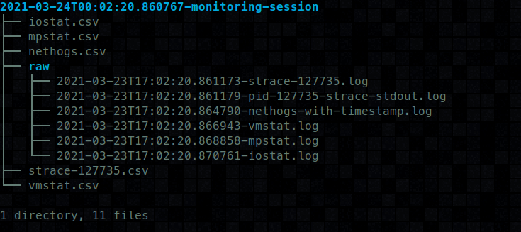

# Monitoring All The Things


WARNING: These repo, and its author have been heavily been inspired by: https://principlesofchaos.org/

Sometimes webservices perform admirably. Fast response times, efficient processing loops, etc. However if you are
like me, sometimes your services get overwhelmed. Or sometimes some bugs get introduced that unfortunately block
an asynch loop. Or maybe you are spending too much time processing, or running your system out of memory.

Like most problems, in order to solve it you must create it. Looking through my repositories you'll find many different
types of load testing tools and infrastructure I've built to do this. Pressing on a service and watching it die is an extremely
useful way to determine how your service will fair in under realistic production situations.

But when you do press it, and it dies. What do you do?

This repo exists to answer that question.

# Requirements

* Debian friendly system (or willing to install deps manually)
* python3.8
* pip

# Usage

Clone this repo!

install the dependencies for debian
```sh
sudo ./install-debian-dependencies.sh
```

Install the required pip-packages
```sh
pip install -r requirements.txt
```

Run main.py
```
./main.py 
```

It will generate a report coalescing multiple csvs into one directory for you to easy view and process:



# Supports

* vmstat
* iostat
* nethogs
* mpstat
* nvidia-smi
* strace
* ...
